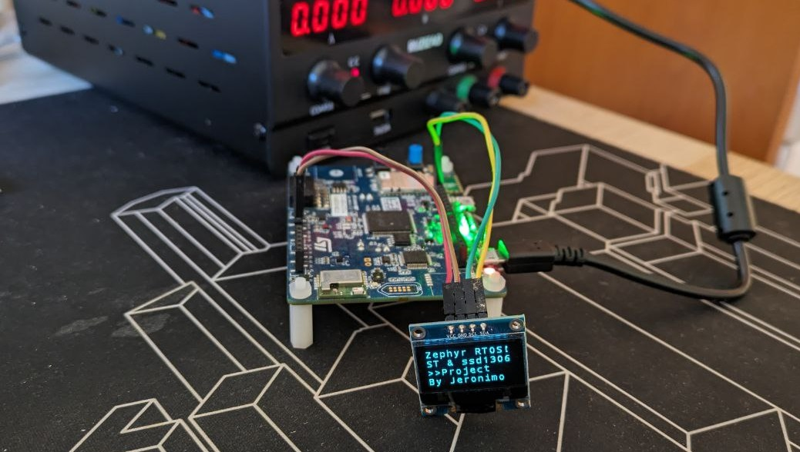
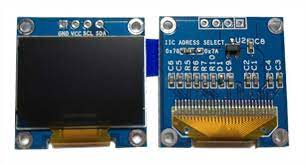

# Zephyr TTF fonts for CFB
This project shows how to use True Type fonts (TTF) in Zephyr into Zephyr fonts to be used by [monochrome caracter Framebuffer (CFB)](https://docs.zephyrproject.org/apidoc/latest/group__monochrome__character__framebuffer.html) API for displays such as ssd1306.



If you want to know everyting about CFB in Zephyr, you are in the correct repository!

## 🎯 Configure display - device tree and Kconfig

### Device tree and shields
First of all, you need to have a displayed configured and ready to be used by the CFB API. In this project, I have selected the well-known ssd1306, which is a 128x64 OLED display.



This display is alredy implemented in Zephyr by a Shield named `ssd1306_128x64` which is connected into a i2c node named `arduino_i2c`. The content of the shield can be found in the route `zephyr/boards/shields/ssd1306/ssd1306_128x64.overlay`, which contains the following device tree definition:

```dts
/ {
	chosen {
		zephyr,display = &sh1106_sh1106_128x64;
	};
};

&arduino_i2c {
	status = "okay";

	sh1106_sh1106_128x64: ssd1306@3c {
		compatible = "sinowealth,sh1106";
		reg = <0x3c>;
		width = <128>;
		height = <64>;
		segment-offset = <2>;
		page-offset = <0>;
		display-offset = <0>;
		multiplex-ratio = <63>;
		segment-remap;
		com-invdir;
		prechargep = <0x22>;
	};
};
```

In this shield, a node named `sh1106_sh1106_128x64` is defined within node `arduino_i2c` with all required information for the CFB API such as the width, height and offset among others. Besides, a *chosen* is defined to facilitate the access to the display from the code as we will se later.

Thus, we can take advantage of this shield and speed up our development, which is one of the great features of Zephyr RTOS. However, probably, our board has not a i2c node whose alias is `arduino_i2c`. Then, we need to add a simple overlay to alias an i2c node of our board properly. In my case, I have used the `i2c1` node adding:

```dts
arduino_i2c: &i2c1{
	status = "okay";
};
```

Now, we are ready to use the ssd1306 shield.

### Kconfig - prj.conf file
Once the display is already defined at hardware level, we need to add the corresponding Kconfig variables into our `prj.conf` configuration file to compile and link the proper libraries for CFB API.

We need to include the following variables:
```kconfig
# display
CONFIG_DISPLAY=y

# CFB API
CONFIG_CHARACTER_FRAMEBUFFER=y
# needed for the k_malloc function used by cfb library
CONFIG_HEAP_MEM_POOL_SIZE=16384

# log
CONFIG_LOG=y
CONFIG_LOG_DEFAULT_LEVEL=1
CONFIG_CFB_LOG_LEVEL_DBG=y
```

## 🖥️ Character Bufferframe (CFB) API functions
After the previous configuration, you can dive into programming code for the display.

### Get display in our code
The first step is to get the pointer to our display. For this aim, you need to define a `device struct` pointer:

```c
const struct device *display_device;
```

Then, you can use the `DEVICE_DT_GET` and `DT_CHOSEN` macros to get easily the device pointer based on the chosen name provided by the shield (check out the previous section for more info).

```c
display_device = DEVICE_DT_GET(DT_CHOSEN(zephyr_display));
```

### Configure display
You must set the pixel format, wich can be done easily with `display_set_pixel_format` function:

```c
if (display_set_pixel_format(display_device, PIXEL_FORMAT_MONO10) != 0) {
		if (display_set_pixel_format(display_device, PIXEL_FORMAT_MONO01) != 0) {
			LOG_ERR("Failed to set required pixel format");
		}
	}
```

Then, you initialize the framebuffer with `cfb_framebuffer_init` function passing the display pointer as parameter:

```c
if (cfb_framebuffer_init(display_device)) {
	LOG_ERR("Framebuffer initialization failed!\n");
}
```
### Get display information
You can get the display information by the `cfb_get_display_parameter` chaging the passing parameters. For example, the most relevant information can be get as following:

```c
x_res = cfb_get_display_parameter(display_device, CFB_DISPLAY_WIDTH);
y_res = cfb_get_display_parameter(display_device, CFB_DISPLAY_HEIGH);
rows = cfb_get_display_parameter(display_device, CFB_DISPLAY_ROWS);
cols = cfb_get_display_parameter(display_device, CFB_DISPLAY_COLS);
ppt = cfb_get_display_parameter(display_device, CFB_DISPLAY_PPT);

// log display parameters
LOG_INF("Display parameters: x_res %d, y_res %d, ppt %d, rows %d, cols %d",
		x_res, y_res, ppt, rows, cols);
```

### Display text
Finally, you are ready to display text into the display. Keep in mind that the display is handled by a framebuffer which is fulfilled before being displayed.

Firstly, you need to set the font that you want to use (remember you can get the total number of available fonts by `cfb_get_numof_fonts` function):

```c
cfb_framebuffer_set_font(display_device, 0);
```

Before displaying information you need to clear the framebuffer:

```c
cfb_framebuffer_clear(display_device, false);
```

Now, you can call `cfb_print` to display text. The arguments are the display pointer, the string to be displayed and the coordinates in which the string will be displayed, for example:

```
cfb_print(display_device, "Zephyr RTOS!!",0,0);
```

Once the framebuffer is ready, you must called the `cfb_framebuffer_finalize` function to set the framebuffer into the display to visualize it:

```c
cfb_framebuffer_finalize(display_device);
```

## 🛠️ Build the project

Choose your board by running:

```bash
west build -b <your_board>
```

It was tested with STM32L4S5 board and SSD1306 OLED display. The display was configured by the corresponding shield. Then, run the following command:
```
west build -b b_l4s5i_iot01a -- -DSHIELD=ssd1306_128x64
```

## ⚡️ Flash

Flash it to your board with:

```bash
west flash
```